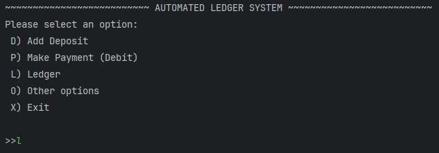
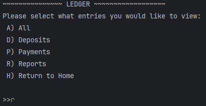
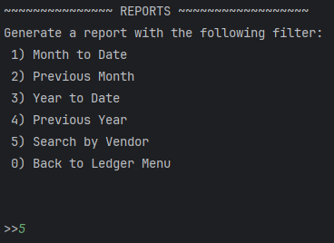
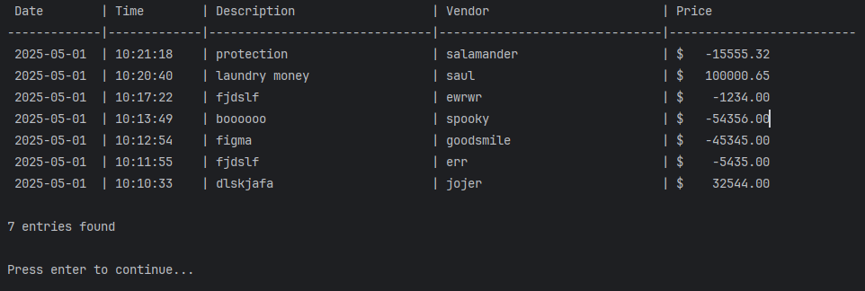
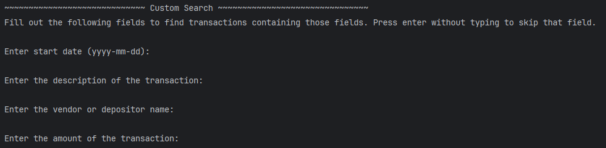

# CLI-Accounting-Ledger
Command line interface application to record financial transactions.
### Features: 
- Add deposits
- Make payments
- View ledger report 
  - Filter by current month, previous month, current year, previous year
  - Search for specific vendors
- Save records to csv file

### Screenshots







### Code highlight: Custom Search

This code receives various search fields to filter out transactions. 
It will then loop through the transaction list and display all transactions
that match the search fields. If a field is left blank, it is skipped.
```
LedgerFunctions.java Line 99
  static LocalDate startDate = null;
  static LocalDate endDate = null;
  static String searchDescription = "";
  static String searchVendor = "";
  static Float searchPrice = null;
  //Custom search
  public static void customSearch(){
      //init as null
      startDate = null;
      endDate = null;
      searchDescription = null;
      searchVendor = null;
      searchPrice = null;
  
      System.out.println("~~~~~~~~~~~~~~~~~~~~~~~~~~~~~ Custom Search ~~~~~~~~~~~~~~~~~~~~~~~~~~~~~~~");
      System.out.println("Fill out the following fields to find transactions containing those fields. Press enter without typing to skip that field.");
      try{Thread.sleep(500);} catch (InterruptedException e) {throw new RuntimeException(e);}
  
      try {
          System.out.print("\nEnter start date (yyyy-mm-dd): ");
          String startDateString = read.nextLine();
          if (startDateString != ""){
              startDate = LocalDate.parse(startDateString);
          }else startDate = null;
  
          if (startDateString != "") {
              System.out.print("\nEnter end date (yyyy-mm-dd): ");
              endDate = LocalDate.parse(read.nextLine());
          }else endDate = null;
  
          System.out.print("\nEnter the description of the transaction: ");
          searchDescription = read.nextLine();
  
          System.out.print("\nEnter the vendor or depositor name: ");
          searchVendor = read.nextLine();
  
          System.out.print("\nEnter the amount of the transaction: ");
          String searchPriceString = read.nextLine();
  
          if (searchPriceString != ""){
              searchPrice = Float.parseFloat(searchPriceString);
          } else searchPrice = null;
  
          displayLedger("custom");
      } catch (DateTimeParseException e){
          System.out.println("Invalid Date");
      } catch (Exception e){
          System.out.println("Invalid search term");
          e.printStackTrace();
      }
  
  }

LedgerFunctions.java line 77
    case "custom":
        condition = true;
        if(startDate != null){
            if (!(t.getDate().isAfter(startDate) && t.getDate().isBefore(endDate) || t.getDate().equals(startDate))) condition = false;
        }
        if (searchDescription != "") if (!t.getDescription().contains(searchDescription)) condition = false;
        if (searchVendor != "") if (!t.getVendor().contains(searchVendor)) condition = false;
        if (searchPrice != null) if (!(t.getPrice() == searchPrice)) condition = false;
        break;
```
